[](https://classroom.github.com/a/aRvIU2lf)

| Name           | NRP        | Kelas     |
| Lyonel Oliver Dwiputra      | 5025241145  | A|
| ... | ... | ... |


## Put your topology config image here!

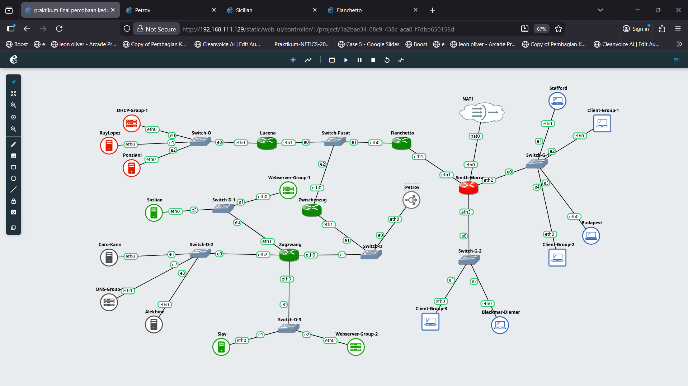

## Put your GNS3 Project file here!

https://drive.google.com/file/d/13sk0YXjt4BKa7kkK5XLwr1nlsSqcuxbl/view?usp=sharing

<br>

## Soal 1

> Menggunakan metode VLSM, buatlah pembagian subnet untuk masing-masing gedung dengan cara yang seefisien mungkin!

> _Using the VLSM method, create subnets for each building as efficiently as possible!_

**Answer:**

- Screenshot

  


.png>)

- Explanation

LUCENA 
```bash
auto eth0
iface eth0 inet static
	address 10.47.41.129
	netmask 255.255.255.192

auto eth1
iface eth1 inet static
	address 10.47.41.209
	netmask 255.255.255.248
```	
ZWISCHENZUG
```bash
auto eth0
iface eth0 inet static
	address 10.47.41.210
	netmask 255.255.255.248


auto eth1
iface eth1 inet static
	address 10.47.41.217
	netmask 255.255.255.248

```
FIANCHETTO
```bash
auto eth0
iface eth0 inet static
	address 10.47.41.211
	netmask 255.255.255.248

auto eth1
iface eth1 inet static
	address 10.47.41.225
	netmask 255.255.255.252
```
ZUGZWANG
```bash
auto eth0
iface eth0 inet static
	address 10.47.41.219
	netmask 255.255.255.248
	gateway 10.47.41.217

auto eth1
iface eth1 inet static
	address 10.47.41.1
	netmask 255.255.255.128

auto eth2
iface eth2 inet static
	address 10.47.41.193
	netmask 255.255.255.240

auto eth3
iface eth3 inet static
	address 10.47.40.1
	netmask 255.255.255.0
```
SMITH-MORRA
```bash
auto eth0
iface eth0 inet dhcp

auto eth1
iface eth1 inet static
	address 10.47.41.226
	netmask 255.255.255.252

auto eth2
iface eth2 inet static
	address 10.47.32.1
	netmask 255.255.248.0

auto eth3
iface eth3 inet static
	address 10.47.0.1
	netmask 255.255.224.0
  ```

PONZIANI
```bash
auto eth0
iface eth0 inet static
	address 10.47.41.130
	netmask 255.255.255.192
	gateway 10.47.41.129
	up echo nameserver 10.47.41.194 > /etc/resolv.conf
```
RUYLOPEZ
```bash
auto eth0
iface eth0 inet static
	address 10.47.41.131
	netmask 255.255.255.192
	gateway 10.47.41.129
	up echo nameserver 10.47.41.194 > /etc/resolv.conf
```
CARO-KANN
```bash
auto eth0
iface eth0 inet static
	address 10.47.41.194
	netmask 255.255.255.240
	gateway 10.47.41.193
	up echo nameserver 10.47.41.194 > /etc/resolv.conf
```
ALEKHINE
```bash
auto eth0
iface eth0 inet static
	address 10.47.41.195
	netmask 255.255.255.240
	gateway 10.47.41.193
	up echo nameserver 10.47.41.194 > /etc/resolv.conf
```
PETROV
```bash
auto eth0
iface eth0 inet static
	address 10.47.41.218
	netmask 255.255.255.248
	gateway 10.47.41.217
	up echo nameserver 10.47.41.194 > /etc/resolv.conf
```

SICILIAN
```bash
auto eth0
iface eth0 inet dhcp
```
SLAV
```bash
auto eth0
iface eth0 inet dhcp
```
STAFFORD
```bash
auto eth0
iface eth0 inet dhcp
```
BUDAPEST
```bash
auto eth0
iface eth0 inet dhcp
```
BLACKMAR-DIEMER
```bash
auto eth0
iface eth0 inet dhcp
```

Penerapan VLSM dilakukan untuk membagi ruang alamat IP secara efisien sesuai kebutuhan host tiap gedung. Konfigurasi IP statis dilakukan dengan mengedit file /etc/network/interfaces, menggunakan sintaks iface eth0 inet static diikuti dengan address dan netmask yang sesuai untuk menetapkan identitas jaringan yang permanen pada router dan server utama, memisahkan broadcast domain antar gedung.

<br>

## Soal 2

> Konfigurasi semua router agar bisa terhubung ke semua jaringan. Gunakan static routing dan uji dengan melakukan ping dari **Budapest** ke **Alekhine** dan dari **Ponziani** ke **Sicilian**!

> _Configure all routers to connect to all networks. Use static routing and perform testing by pinging from **Budapest** to **Alekhine** and from **Ponziani** to **Sicilian**!_

**Answer:**

- Screenshot

  


- Explanation

 LUCENA
```bash
auto eth0
iface eth0 inet static
	address 10.47.41.129
	netmask 255.255.255.192

auto eth1
iface eth1 inet static
	address 10.47.41.209
	netmask 255.255.255.248
	up ip route add 10.47.40.0/24 via 10.47.41.210
	up ip route add 10.47.41.0/25 via 10.47.41.210
	up ip route add 10.47.41.192/28 via 10.47.41.210
	up ip route add 10.47.41.216/29 via 10.47.41.210
	up ip route add 10.47.41.224/30 via 10.47.41.210
	up ip route add 10.47.0.0/18 via 10.47.41.211
  up ip route add default via 10.47.41.211
```

ZWISCHENZUG
```bash
auto eth0
iface eth0 inet static
	address 10.47.41.210
	netmask 255.255.255.248
	up ip route add 10.47.41.128/26 via 10.47.41.209
	up ip route add 10.47.0.0/18 via 10.47.41.211

auto eth1
iface eth1 inet static
	address 10.47.41.217
	netmask 255.255.255.248
	up ip route add 10.47.40.0/24 via 10.47.41.219
	up ip route add 10.47.41.0/25 via 10.47.41.219
	up ip route add 10.47.41.192/28 via 10.47.41.219
  up ip route add default via 10.47.41.211
```

FIANCHETTO
```bash
auto eth0
iface eth0 inet static
    address 10.47.41.211
    netmask 255.255.255.248
    up ip route add 10.47.41.128/26 via 10.47.41.209
    up ip route add 10.47.40.0/24 via 10.47.41.210
    up ip route add 10.47.41.0/25 via 10.47.41.210
    up ip route add 10.47.41.192/28 via 10.47.41.210
    up ip route add 10.47.41.216/29 via 10.47.41.210

auto eth1
iface eth1 inet static
    address 10.47.41.225
    netmask 255.255.255.252
    up ip route add 10.47.0.0/18 via 10.47.41.226
    up ip route add default via 10.47.41.226
```


ZUGZWANG
```bash
auto eth0
iface eth0 inet static
	address 10.47.41.219
	netmask 255.255.255.248
	gateway 10.47.41.217

auto eth1
iface eth1 inet static
	address 10.47.41.1
	netmask 255.255.255.128

auto eth2
iface eth2 inet static
	address 10.47.41.193
	netmask 255.255.255.240

auto eth3
iface eth3 inet static
	address 10.47.40.1
	netmask 255.255.255.0

  up ip route add default via 10.47.41.217
```

SMITH-MORRA

```bash
auto eth0
iface eth0 inet dhcp

auto eth1
iface eth1 inet static
	address 10.47.41.226
	netmask 255.255.255.252
	up ip route add 10.47.41.128/26 via 10.47.41.225
	up ip route add 10.47.40.0/24 via 10.47.41.225
	up ip route add 10.47.41.0/25 via 10.47.41.225
	up ip route add 10.47.41.192/28 via 10.47.41.225
	up ip route add 10.47.41.208/29 via 10.47.41.225
	up ip route add 10.47.41.216/29 via 10.47.41.225

auto eth2
iface eth2 inet static
	address 10.47.32.1
	netmask 255.255.248.0

auto eth3
iface eth3 inet static
	address 10.47.0.1
	netmask 255.255.224.0
```


Konfigurasi routing statis diterapkan pada setiap router untuk mendaftarkan jalur menuju subnet terpencil. Perintah up ip route add [Network_ID] via [Next_Hop] ditambahkan di konfigurasi interface untuk mendefinisikan jalur secara manual, sementara ip route add default via ... pada router inti memastikan paket yang tujuannya tidak diketahui (seperti internet) diarahkan ke gateway utama di Smith-Morra.
<br>

## Soal 3

> Berikan seluruh client (**Blackmar-Diemer, Budapest,** dan **Stafford**) IP secara dinamis dari DHCP. Range IP dibebaskan, namun tunjukkan bahwa mereka mendapatkan IP secara dinamis!

> _Assign all clients (**Blackmar-Diemer, Budapest,** and **Stafford**) dynamic IP addresses via DHCP. You may use any IP range you would like, but prove that they receive IP addresses dynamically!_

**Answer:**

- Screenshot

  
  
  


- Explanation

SMITH-MORRA

```bash
echo "nameserver 8.8.8.8" > /etc/resolv.conf
echo "net.ipv4.ip_forward=1" > /etc/sysctl.conf

apt-get update
apt-get install -y iptables
apt-get install -y  isc-dhcp-relay

iptables -t nat -A POSTROUTING -o eth0 -j MASQUERADE


cat > /etc/default/isc-dhcp-relay << 'EOF'
SERVERS="10.47.41.130 10.47.41.131"
INTERFACES="eth1 eth2 eth3"
OPTIONS=""
EOF
```

```bash
service isc-dhcp-relay restart
```
PONZIANI

```bash
echo "nameserver 8.8.8.8" > /etc/resolv.conf

apt-get update
apt-get install -y isc-dhcp-server

echo 'INTERFACESv4="eth0"' > /etc/default/isc-dhcp-server
```

```bash
cat > /etc/dhcp/dhcpd.conf << 'EOF'
option domain-name "burung.terbang";
option domain-name-servers 10.47.41.194, 10.47.41.195;
default-lease-time 600;
max-lease-time 7200;
authoritative;

failover peer "amba.labu" {
    primary;
    address 10.47.41.130;
    port 647;
    peer address 10.47.41.131;
    peer port 647;
    max-response-delay 60;
    max-unacked-updates 10;
    mclt 3600;
    split 128;
    load balance max seconds 3;
}

subnet 10.47.41.128 netmask 255.255.255.192 {
    pool {
        failover peer "amba.labu";
        range 10.47.41.140 10.47.41.150;
    }
    option routers 10.47.41.129;
}

subnet 10.47.32.0 netmask 255.255.248.0 {
    pool {
        failover peer "amba.labu";
        range 10.47.32.10 10.47.32.200;
    }
    option routers 10.47.32.1;
    option broadcast-address 10.47.39.255;
}

subnet 10.47.0.0 netmask 255.255.224.0 {
    pool {
        failover peer "amba.labu";
        range 10.47.0.10 10.47.0.200;
    }
    option routers 10.47.0.1;
    option broadcast-address 10.47.31.255;
}
EOF
```
```bash
service isc-dhcp-server restart
```
RUYLOPEZ
```bash
echo "nameserver 8.8.8.8" > /etc/resolv.conf

apt-get update
apt-get install -y isc-dhcp-server

echo 'INTERFACESv4="eth0"' > /etc/default/isc-dhcp-server
```
```bash
cat > /etc/dhcp/dhcpd.conf << 'EOF'
option domain-name "burung.terbang";
option domain-name-servers 10.47.41.194, 10.47.41.195;
default-lease-time 600;
max-lease-time 7200;
authoritative;

failover peer "amba.labu" {
    secondary;
    address 10.47.41.131;
    port 647;
    peer address 10.47.41.130;
    peer port 647;
    max-response-delay 60;
    max-unacked-updates 10;
    load balance max seconds 3;
}

subnet 10.47.41.128 netmask 255.255.255.192 {
    pool {
        failover peer "amba.labu";
        range 10.47.41.140 10.47.41.150;
    }
    option routers 10.47.41.129;
}

subnet 10.47.32.0 netmask 255.255.248.0 {
    pool {
        failover peer "amba.labu";
        range 10.47.32.10 10.47.32.200;
    }
    option routers 10.47.32.1;
    option broadcast-address 10.47.39.255;
}

subnet 10.47.0.0 netmask 255.255.224.0 {
    pool {
        failover peer "amba.labu";
        range 10.47.0.10 10.47.0.200;
    }
    option routers 10.47.0.1;
    option broadcast-address 10.47.31.255;
}
EOF
```
```bash
service isc-dhcp-server restart
```

BUDAPEST, STAFFORD, BLACKMAR-DIEMER
```bash
restart
```
Layanan DHCP Failover dan Relay disiapkan untuk distribusi IP otomatis. Pada server, blok konfigurasi failover peer "nama_peer" dan deklarasi subnet dengan parameter range digunakan untuk mengatur kolam IP dan sinkronisasi antar server. Pada router Smith-Morra, variabel SERVERS dan INTERFACES di file /etc/default/isc-dhcp-relay diatur agar router meneruskan paket DHCPDISCOVER dari klien ke server DHCP yang berada di jaringan berbeda.
<br>

## Soal 4

> Berikan web server **Slav** dan **Sicilian** IP address yang tetap/fixed dari DHCP. 

> _Assign **Slav** and **Sicilian** web servers fixed IP addresses via DHCP._

**Answer:**

- Screenshot

  


- Explanation

SLAV di network configuration tambahin
```bash
hwaddress ether 16:1c:1f:1a:15:5b
```

SICILIAN di network configuration tambahin
```bash
hwaddress ether 02:42:af:d6:b7:00
```

PONZIANI
```bash
cat > /etc/dhcp/dhcpd.conf << 'EOF'
option domain-name "burung.terbang";
option domain-name-servers 10.47.41.194, 10.47.41.195;
default-lease-time 600;
max-lease-time 7200;
authoritative;

failover peer "amba.labu" {
    primary;
    address 10.47.41.130;
    port 647;
    peer address 10.47.41.131;
    peer port 647;
    max-response-delay 60;
    max-unacked-updates 10;
    mclt 3600;
    split 128;
    load balance max seconds 3;
}

subnet 10.47.41.128 netmask 255.255.255.192 {
    pool { failover peer "amba.labu"; range 10.47.41.140 10.47.41.150; }
    option routers 10.47.41.129;
}

subnet 10.47.32.0 netmask 255.255.248.0 {
    pool { failover peer "amba.labu"; range 10.47.32.10 10.47.32.200; }
    option routers 10.47.32.1;
    option broadcast-address 10.47.39.255;
}

subnet 10.47.0.0 netmask 255.255.224.0 {
    pool { failover peer "amba.labu"; range 10.47.0.10 10.47.0.200; }
    option routers 10.47.0.1;
    option broadcast-address 10.47.31.255;
}

subnet 10.47.41.0 netmask 255.255.255.128 { option routers 10.47.41.1; }
subnet 10.47.40.0 netmask 255.255.255.0 { option routers 10.47.40.1; }

host sicilian {
    hardware ethernet 02:42:af:d6:b7:00;
    fixed-address 10.47.41.11;
}

host slav {
    hardware ethernet 16:1c:1f:1a:15:5b;
    fixed-address 10.47.40.11;
}
EOF
```
```bash
service isc-dhcp-server restart
```
```bash
RUYLOPEZ (SECONDARY)
cat > /etc/dhcp/dhcpd.conf << 'EOF'
option domain-name "burung.terbang";
option domain-name-servers 10.47.41.194, 10.47.41.195;
default-lease-time 600;
max-lease-time 7200;
authoritative;

failover peer "amba.labu" {
    secondary;
    address 10.47.41.131;
    port 647;
    peer address 10.47.41.130;
    peer port 647;
    max-response-delay 60;
    max-unacked-updates 10;
    load balance max seconds 3;
}

subnet 10.47.41.128 netmask 255.255.255.192 {
    pool { failover peer "amba.labu"; range 10.47.41.140 10.47.41.150; }
    option routers 10.47.41.129;
}

subnet 10.47.32.0 netmask 255.255.248.0 {
    pool { failover peer "amba.labu"; range 10.47.32.10 10.47.32.200; }
    option routers 10.47.32.1;
    option broadcast-address 10.47.39.255;
}

subnet 10.47.0.0 netmask 255.255.224.0 {
    pool { failover peer "amba.labu"; range 10.47.0.10 10.47.0.200; }
    option routers 10.47.0.1;
    option broadcast-address 10.47.31.255;
}

subnet 10.47.41.0 netmask 255.255.255.128 { option routers 10.47.41.1; }
subnet 10.47.40.0 netmask 255.255.255.0 { option routers 10.47.40.1; }

host sicilian {
    hardware ethernet 02:42:af:d6:b7:00;
    fixed-address 10.47.41.11;
}

host slav {
    hardware ethernet 16:1c:1f:1a:15:5b;
    fixed-address 10.47.40.11;
}
EOF
```
```bash
service isc-dhcp-server restart
```


ZUGZWANG
```bash
echo "nameserver 8.8.8.8" > /etc/resolv.conf
echo "net.ipv4.ip_forward=1" > /etc/sysctl.conf

apt-get update
apt-get install -y isc-dhcp-relay

cat > /etc/default/isc-dhcp-relay << 'EOF'
SERVERS="10.47.41.130 10.47.41.131"
INTERFACES="eth0 eth1 eth2 eth3"
OPTIONS=""
EOF
```
```bash
service isc-dhcp-relay restart
```
Pemetaan IP tetap untuk server dilakukan menggunakan fitur Static Lease. Dalam file dhcpd.conf, blok host nama_host { ... } dibuat berisi parameter hardware ethernet (MAC Address) dan fixed-address (IP target) untuk mengunci IP server. Di sisi klien, perintah hwaddress ether ditambahkan ke konfigurasi interface untuk memaksa penggunaan MAC Address tertentu agar tetap konsisten saat simulasi di-restart.
<br>

## Soal 5

> Buatlah konfigurasi untuk domain:  
**parkov.com** → IP Node **Slav**  
**paskarov.com** → IP Node **Sicilian** 
Pada **DNS Master Caro-Kann.** Tambahkan juga subdomain www untuk kedua domain tersebut.

> _Configure the domains:  
**parkov.com** → **Slav** Node IP  
**paskarov.com** → **Sicilian** Node IP  
On the **Caro-Kann DNS Master,** then add the www subdomain for both domains._

**Answer:**

- Screenshot


- Explanation

CARO-KANN
```bash
cat >> /etc/bind/named.conf.local << 'EOF'
zone "parkov.com" {
    type master;
    file "/etc/bind/db.parkov.com";
};

zone "paskarov.com" {
    type master;
    file "/etc/bind/db.paskarov.com";
};
EOF
```
```bash
cat > /etc/bind/db.parkov.com << 'EOF'
$TTL 604800
@ IN SOA caro-kann.burung.terbang. root.parkov.com. (
    2025120202
    604800
    86400
    2419200
    604800 )
@            IN      NS      caro-kann.burung.terbang.
@            IN      A       10.47.40.11
www          IN      A       10.47.40.11
EOF
```
```bash
cat > /etc/bind/db.paskarov.com << 'EOF'
$TTL 604800
@ IN SOA caro-kann.burung.terbang. root.paskarov.com. (
    2025120202
    604800
    86400
    2419200
    604800 )
@            IN      NS      caro-kann.burung.terbang.
@            IN      A       10.47.41.11
www          IN      A       10.47.41.11
EOF
```
```bash
killall named 
named -u bind
```
Zona domain parkov.com dan paskarov.com dibuat pada server Master. Konfigurasi dilakukan dengan menambahkan blok zone "nama_domain" { type master; file "..."; }; pada named.conf.local untuk mendefinisikan zona, serta membuat file database zona (db.*) yang berisi Resource Records seperti NS (Name Server) dan A (Address) untuk memetakan nama domain ke IP Address server worker.
<br>

## Soal 6

> Konfigurasikan juga **Alekhine** sebagai **DNS Slave** yang bekerja untuk membantu **Caro-Kann.** Lakukan pengujian dengan **mematikan Caro-Kann** lalu coba ping ke domain dan subdomain tersebut (pilih salah satu saja).

> _Configure **Alekhine** as a **DNS Slave** to assist **Caro-Kann**. Perform testing by **disabling Caro-Kann** and then pinging the domain and subdomain (choose only one)._

**Answer:**

- Screenshot

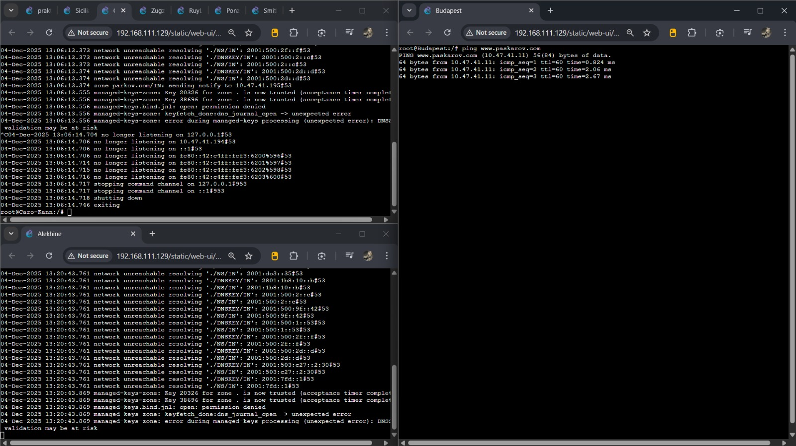
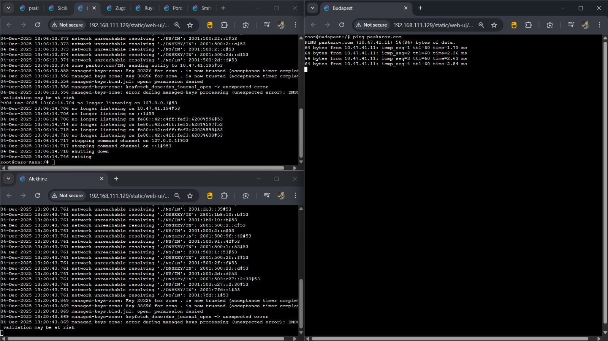
- Explanation

CARO-KANN
```bash
cat > /etc/bind/named.conf.local << 'EOF'
zone "parkov.com" {
    type master;
    notify yes;
    also-notify { 10.47.41.195; };
    file "/etc/bind/db.parkov.com";
    allow-transfer { any; };
};

zone "paskarov.com" {
    type master;
    notify yes;
    also-notify { 10.47.41.195; };
    file "/etc/bind/db.paskarov.com";
    allow-transfer { any; };
};
EOF
```
```bash
named -g
```
ALEKHINE
```bash
echo "nameserver 8.8.8.8" > /etc/resolv.conf
apt-get update
apt-get install -y bind9

cat > /etc/bind/named.conf.local << 'EOF'
zone "parkov.com" {
    type slave;
    masters { 10.47.41.194; };
    file "/var/lib/bind/db.parkov.com";
};

zone "paskarov.com" {
    type slave;
    masters { 10.47.41.194; };
    file "/var/lib/bind/db.paskarov.com";
};
EOF
```

```bash
named -g
```

Server Alekhine dikonfigurasi sebagai Slave untuk redundansi. Pada konfigurasi named.conf.local di Slave, digunakan sintaks type slave dan masters { IP_Master; } untuk menginstruksikan BIND9 menyalin data dari Master. Di sisi Master, direktif allow-transfer dan notify yes ditambahkan agar Master mengizinkan replikasi data dan memberitahu Slave setiap kali ada perubahan zona.
<br>

## Soal 7

> Konfigurasikan **Sicilian** agar berfungsi sebagai **web server nginx** yang akan menyajikan [halaman berikut](https://drive.google.com/file/d/1eX0ZjRKprx8T34XFAssrpc7ZE1j6Jv0j/view). Konfigurasikan juga agar **Sicilian** bisa menyimpan custom access log ke file **/tmp/access.log** dan error log ke file **/tmp/error.log.**

> _Configure **Sicilian** to function as an **nginx web server**that will serve [this page](https://drive.google.com/file/d/1eX0ZjRKprx8T34XFAssrpc7ZE1j6Jv0j/view). Also, configure **Sicilian** to save custom access logs to **/tmp/access.log** and error logs to **/tmp/error.log.**_

**Answer:**

- Screenshot

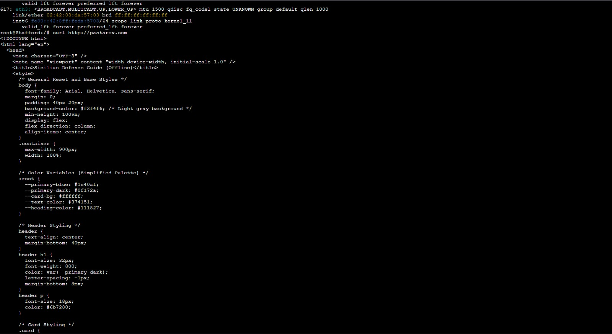

- Explanation

SICILIAN
```bash
echo "nameserver 8.8.8.8" > /etc/resolv.conf
apt-get update
apt-get install -y nginx
```
```bash
cat > /var/www/html/index.html << 'EOF'
<!DOCTYPE html>
<html lang="en">
  <head>
    <meta charset="UTF-8" />
    <meta name="viewport" content="width=device-width, initial-scale=1.0" />
    <title>Sicilian Defense Guide (Offline)</title>
    <style>
      /* General Reset and Base Styles */
      body {
        font-family: Arial, Helvetica, sans-serif;
        margin: 0;
        padding: 40px 20px;
        background-color: #f3f4f6; /* Light gray background */
        min-height: 100vh;
        display: flex;
        flex-direction: column;
        align-items: center;
      }
      .container {
        max-width: 900px;
        width: 100%;
      }

      /* Color Variables (Simplified Palette) */
      :root {
        --primary-blue: #1e40af;
        --primary-dark: #0f172a;
        --card-bg: #ffffff;
        --text-color: #374151;
        --heading-color: #111827;
      }

      /* Header Styling */
      header {
        text-align: center;
        margin-bottom: 40px;
      }
      header h1 {
        font-size: 32px;
        font-weight: 800;
        color: var(--primary-dark);
        letter-spacing: -1px;
        margin-bottom: 8px;
      }
      header p {
        font-size: 18px;
        color: #6b7280;
      }

      /* Card Styling */
      .card {
        background-color: var(--card-bg);
        padding: 30px;
        border-radius: 12px;
        box-shadow: 0 10px 15px -3px rgba(0, 0, 0, 0.1),
          0 4px 6px -2px rgba(0, 0, 0, 0.05);
        border-top: 4px solid var(--primary-blue);
      }

      .card-header {
        display: flex;
        align-items: center;
        margin-bottom: 16px;
      }
      .card-header span {
        font-size: 28px;
        margin-right: 12px;
      }
      .card-header h2 {
        font-size: 24px;
        font-weight: 700;
        color: var(--primary-blue);
      }
      .card h3 {
        font-size: 20px;
        font-weight: 600;
        color: var(--heading-color);
        margin-bottom: 20px;
      }

      /* Content Styles */
      .content p {
        color: var(--text-color);
        line-height: 1.6;
        margin-bottom: 20px;
      }

      /* Code Block/Key Lines */
      .key-sequence {
        background-color: #e5e7eb;
        padding: 15px;
        border-radius: 8px;
        margin-bottom: 20px;
      }
      .key-sequence h4 {
        font-size: 16px;
        font-weight: 700;
        margin-bottom: 8px;
        color: var(--primary-dark);
      }
      .key-sequence code {
        display: block;
        background-color: #d1d5db;
        font-family: monospace;
        padding: 10px;
        border-radius: 4px;
        font-size: 14px;
        color: var(--primary-dark);
        white-space: pre-wrap; /* Ensure wrapping on smaller screens */
      }

      /* List Styles */
      .variations-list {
        list-style: disc;
        margin-left: 20px;
        padding-left: 0;
        color: var(--text-color);
        line-height: 1.5;
      }
      .variations-list li {
        margin-bottom: 8px;
      }
      .variations-list strong {
        font-weight: 600;
      }

      /* Footer */
      footer {
        margin-top: 40px;
        padding-top: 20px;
        text-align: center;
        color: #6b7280;
        font-size: 14px;
        border-top: 1px solid #e5e7eb;
      }

      /* Responsive adjustments */
      @media (min-width: 768px) {
        header h1 {
          font-size: 44px;
        }
        .card {
          padding: 40px;
        }
      }
    </style>
  </head>
  <body>
    <div class="container">
      <header>
        <h1>The Sicilian Defense</h1>
        <p>
          Black's most popular, aggressive, and counter-attacking response to 1.
          e4.
        </p>
      </header>

      <main>
        <!-- SICILIAN DEFENSE CARD -->
        <div class="card">
          <div class="card-header">
            <span role="img" aria-label="Knight icon">♞</span>
            <h2>Key Strategies</h2>
          </div>
          <h3 class="opening-move">Start: 1. e4 c5</h3>

          <div class="content">
            <p>
              The Sicilian is a commitment to imbalance. Black immediately
              fights for the d4 square without directly occupying the center,
              inviting White to expand. This often leads to sharp battles,
              especially in the Open Sicilian variations where White plays d4.
              Black aims to undermine White's central control and use the
              half-open c-file. Favored by champions like Kasparov and Fischer,
              this opening requires high skill to play but can be deadly in the
              right hands.
            </p>

            <!-- Key Lines -->
            <div class="key-sequence">
              <h4>Key Move Sequence (Open Sicilian)</h4>
              <code title="1. e4 c5 2. Nf3 Nc6 3. d4 cxd4 4. Nxd4">
                1. e4 c5 2. Nf3 Nc6 3. d4 cxd4 4. Nxd4
              </code>
            </div>

            <!-- Sub-Variations -->
            <div class="variations">
              <h3>Major Sub-Variations:</h3>
              <ul class="variations-list">
                <li>
                  <strong class="font-medium">Najdorf:</strong> 4... a6.
                  Extremely flexible and deep. Black often prepares to challenge
                  the center with ...e5 or initiate queenside play with ...b5.
                </li>
                <li>
                  <strong class="font-medium">Dragon:</strong> 6... g6. Black
                  fianchettoes the dark-squared bishop, leading to sharp,
                  opposite-side castling positions, often involving an attack
                  down the h-file.
                </li>
                <li>
                  <strong class="font-medium">Scheveningen:</strong> Black
                  places pawns on e6 and d6, forming a solid central fortress,
                  but risking a Keres Attack if White is aggressive.
                </li>
                <li>
                  <strong class="font-medium">Taimanov/Kan:</strong> Solid and
                  positional setups, often involving ...e6 and ...a6,
                  prioritizing development and flexible pawn structures over
                  immediate conflict.
                </li>
              </ul>
            </div>
          </div>
        </div>
      </main>

      <footer>
        <p>
          This document is made for Computer Networks 2025.<br />
          -adieos
        </p>
      </footer>
    </div>
  </body>
</html>
EOF
```

/etc/nginx/sites-available/paskarov

```bash
server {
    listen 80;
    server_name paskarov.com www.paskarov.com;

    root /var/www/html;
    index index.html;

    access_log /tmp/access.log sicilian;
    error_log /tmp/error.log;

    location / {
        try_files $uri $uri/ =404;
    }
}
```

/etc/nginx/nginx.conf
di bagian Logging Setting
```bash
log_format sicilian '[$time_local] Jarkom Node Sicilian Access from $remote_addr using method "$request" returned status $status with $body_bytes_sent bytes sent in $request_time seconds';
```

```bash
ln -s /etc/nginx/sites-available/paskarov /etc/nginx/sites-enabled/

rm /etc/nginx/sites-enabled/default

service nginx restart
```
Web server Nginx diinstal pada Sicilian dengan konfigurasi logging khusus. Direktif log_format didefinisikan di blok http pada file nginx.conf menggunakan variabel Nginx seperti $remote_addr, $status, dan $request_time untuk menangkap detail trafik. Format ini kemudian diterapkan pada server block menggunakan perintah access_log /tmp/access.log nama_format untuk menyimpan log ke lokasi yang diminta.
<br>

## Soal 8

> Buatlah custom access log ke file **/tmp/access.log.** Untuk keperluan logging, gunakan format log seperti di bawah:
> - Tanggal dan waktu akses dalam format standar log.
> - Nama node yang sedang diakses.
> - Alamat IP klien yang mengakses website.
> - Metode HTTP dan URI yang diakses oleh klien.
> - Status respons HTTP yang diberikan oleh server.
> - Jumlah byte yang dikirimkan dalam respons.
> - Waktu yang dihabiskan oleh server untuk menangani permintaan.> 
> - Contoh format log yang sesuai:  
[01/Oct/2024:11:30:45 +0000] Jarkom Node Sicilian Access from 192.168.1.15 using method "GET /resep/bayam HTTP/1.1" returned status 200 with 2567 bytes sent in 0.038 seconds

> _Webserver: Create a custom access log to the file **/tmp/access.log.** For logging purposes, use the log format shown below:_
> - _The date and time of access in standard log format._
> - _The name of the node being accessed._
> - _The IP address of the client accessing the website._
> - _The HTTP method and URI accessed by the client._
> - _The HTTP response status returned by the server._
> - _The number of bytes sent in the response._
> - _The time spent by the server processing the request._
> - _Example of appropriate log format:  
[01/Oct/2024:11:30:45 +0000] Jarkom Node Sicilian Access from 192.168.1.15 using method "GET /resep/bayam HTTP/1.1" returned status 200 with 2567 bytes sent in 0.038 seconds_

**Answer:**

- Screenshot

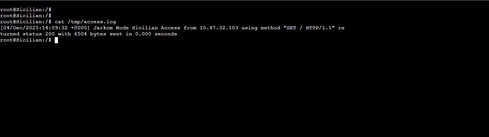

- Explanation
SICILIAN
 /etc/nginx/nginx.conf
 di bagian Logging Setting
```bash
log_format sicilian '[$time_local] Jarkom Node Sicilian Access from $remote_addr using method "$request" returned status $status with $body_bytes_sent bytes sent in $request_time seconds';
```
Direktif log_format didefinisikan di blok http pada file nginx.conf menggunakan variabel Nginx seperti $remote_addr, $status, dan $request_time untuk menangkap detail trafik
<br>

## Soal 9

> Konfigurasikan juga **Slav** agar berfungsi sebagai **web server nginx** yang menyajikan [halaman berikut](https://drive.google.com/file/d/1h8ik1Zcubntp0dvHt9NHYqSZLSTG6FuZ/view) dan **hanya** bisa diakses melalui port **8000** dan **8888.**

> _Configure **Slav** to function as an **nginx web server** that serves [this page](https://drive.google.com/file/d/1h8ik1Zcubntp0dvHt9NHYqSZLSTG6FuZ/view?usp=drive_link) and is **only** accessible via ports **8000** and **8888.**_

**Answer:**

- Screenshot

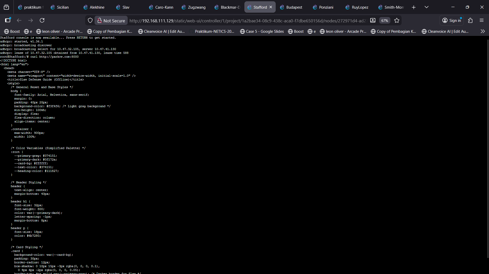
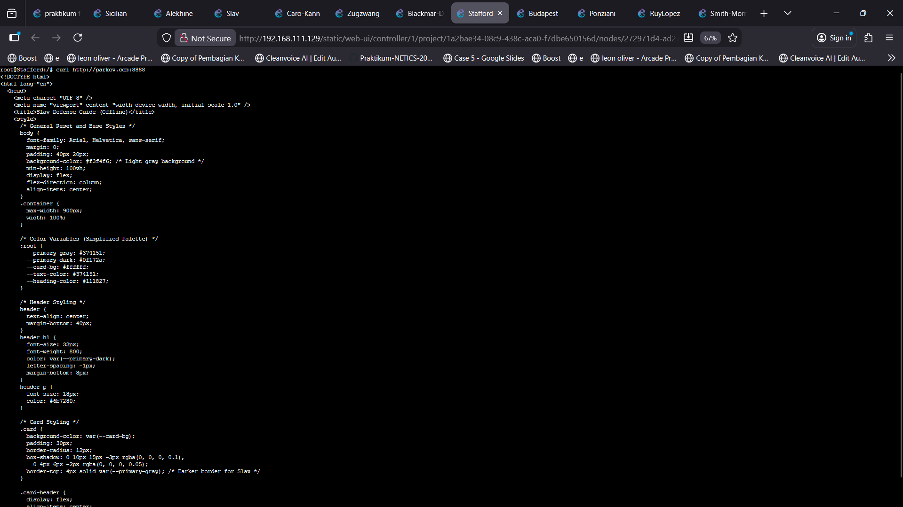

gagal karena bukan di port 8000 atau 8080
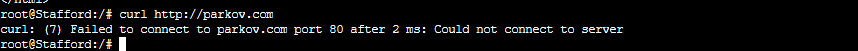

- Explanation

SLAV
```bash
apt-get update
apt-get install -y nginx
```
```bash
cat > /var/www/html/index.html << 'EOF'
<!DOCTYPE html>
<html lang="en">
  <head>
    <meta charset="UTF-8" />
    <meta name="viewport" content="width=device-width, initial-scale=1.0" />
    <title>Slav Defense Guide (Offline)</title>
    <style>
      /* General Reset and Base Styles */
      body {
        font-family: Arial, Helvetica, sans-serif;
        margin: 0;
        padding: 40px 20px;
        background-color: #f3f4f6; /* Light gray background */
        min-height: 100vh;
        display: flex;
        flex-direction: column;
        align-items: center;
      }
      .container {
        max-width: 900px;
        width: 100%;
      }

      /* Color Variables (Simplified Palette) */
      :root {
        --primary-gray: #374151;
        --primary-dark: #0f172a;
        --card-bg: #ffffff;
        --text-color: #374151;
        --heading-color: #111827;
      }

      /* Header Styling */
      header {
        text-align: center;
        margin-bottom: 40px;
      }
      header h1 {
        font-size: 32px;
        font-weight: 800;
        color: var(--primary-dark);
        letter-spacing: -1px;
        margin-bottom: 8px;
      }
      header p {
        font-size: 18px;
        color: #6b7280;
      }

      /* Card Styling */
      .card {
        background-color: var(--card-bg);
        padding: 30px;
        border-radius: 12px;
        box-shadow: 0 10px 15px -3px rgba(0, 0, 0, 0.1),
          0 4px 6px -2px rgba(0, 0, 0, 0.05);
        border-top: 4px solid var(--primary-gray); /* Darker border for Slav */
      }

      .card-header {
        display: flex;
        align-items: center;
        margin-bottom: 16px;
      }
      .card-header span {
        font-size: 28px;
        margin-right: 12px;
      }
      .card-header h2 {
        font-size: 24px;
        font-weight: 700;
        color: var(--primary-gray);
      }
      .card h3 {
        font-size: 20px;
        font-weight: 600;
        color: var(--heading-color);
        margin-bottom: 20px;
      }

      /* Content Styles */
      .content p {
        color: var(--text-color);
        line-height: 1.6;
        margin-bottom: 20px;
      }

      /* Code Block/Key Lines */
      .key-sequence {
        background-color: #e5e7eb;
        padding: 15px;
        border-radius: 8px;
        margin-bottom: 20px;
      }
      .key-sequence h4 {
        font-size: 16px;
        font-weight: 700;
        margin-bottom: 8px;
        color: var(--primary-dark);
      }
      .key-sequence code {
        display: block;
        background-color: #d1d5db;
        font-family: monospace;
        padding: 10px;
        border-radius: 4px;
        font-size: 14px;
        color: var(--primary-dark);
        white-space: pre-wrap; /* Ensure wrapping on smaller screens */
      }

      /* List Styles */
      .variations-list {
        list-style: disc;
        margin-left: 20px;
        padding-left: 0;
        color: var(--text-color);
        line-height: 1.5;
      }
      .variations-list li {
        margin-bottom: 8px;
      }
      .variations-list strong {
        font-weight: 600;
      }

      /* Footer */
      footer {
        margin-top: 40px;
        padding-top: 20px;
        text-align: center;
        color: #6b7280;
        font-size: 14px;
        border-top: 1px solid #e5e7eb;
      }

      /* Responsive adjustments */
      @media (min-width: 768px) {
        header h1 {
          font-size: 44px;
        }
        .card {
          padding: 40px;
        }
      }
    </style>
  </head>
  <body>
    <div class="container">
      <header>
        <h1>The Slav Defense</h1>
        <p>A solid, classical, and structurally sound response to 1. d4.</p>
      </header>

      <main>
        <!-- SLAV DEFENSE CARD -->
        <div class="card">
          <div class="card-header">
            <span role="img" aria-label="Rook icon">♜</span>
            <h2>Key Strategies</h2>
          </div>
          <h3 class="opening-move">Start: 1. d4 d5 2. c4 c6</h3>

          <div class="content">
            <p>
              The Slav is a reliable way for Black to meet 1. d4. The key idea
              of 2... c6 is to reinforce the d5 pawn while keeping the
              light-squared bishop free to develop outside the pawn chain (on f5
              or g4). It often leads to positional maneuvering rather than the
              sharp tactical lines found in the Sicilian, offering excellent
              control over the center.
            </p>

            <!-- Key Lines -->
            <div class="key-sequence">
              <h4>Key Move Sequence (Slav Accepted)</h4>
              <code title="1. d4 d5 2. c4 c6 3. Nf3 Nf6 4. Nc3 dxc4">
                1. d4 d5 2. c4 c6 3. Nf3 Nf6 4. Nc3 dxc4
              </code>
            </div>

            <!-- Sub-Variations -->
            <div class="variations">
              <h3>Major Sub-Variations:</h3>
              <ul class="variations-list">
                <li>
                  <strong class="font-medium">Semi-Slav:</strong> Black plays
                  ...e6 in addition to ...c6. This leads to complex Queen's
                  Gambit Declined structures where Black accepts a blocked c8
                  bishop for a strong central defense.
                </li>
                <li>
                  <strong class="font-medium">Anti-Slav Variations:</strong>
                  White avoids 3. Nc3, often playing 3. Nf3 followed by 4. e3 or
                  4. Qb3, attempting to gain space and challenge Black's
                  development early.
                </li>
                <li>
                  <strong class="font-medium">Chebanenko Slav:</strong> Black
                  plays 3... a6, securing the b5 square for their light-squared
                  bishop or knight, leading to more original and dynamic lines.
                </li>
              </ul>
            </div>
          </div>
        </div>
      </main>

      <footer>
        <p>This document is made for Computer Networks 2025. <br />-adieos</p>
      </footer>
    </div>
  </body>
</html>
EOF
```
```bash
cat > /etc/nginx/sites-available/parkov << 'EOF'
server {
    listen 8000;
    listen 8888;

    server_name parkov.com www.parkov.com;

    root /var/www/html;
    index index.html;

    error_log /var/log/nginx/parkov_error.log;
    access_log /var/log/nginx/parkov_access.log;
}
EOF
```


```bash
ln -s /etc/nginx/sites-available/parkov /etc/nginx/sites-enabled/
rm /etc/nginx/sites-enabled/default
nginx -t
service nginx restart
```

Server Slav dikonfigurasi sebagai worker yang mendengarkan port non-standar. Dalam blok konfigurasi server { ... } Nginx, digunakan direktif listen 8000 dan listen 8888 (tanpa port 80) untuk memastikan server hanya menerima koneksi pada port tersebut, memisahkan layanan ini dari trafik web biasa sebagai persiapan untuk Load Balancing.

<br>

## Soal 10

> Untuk memudahkan akses, buatlah satu domain lagi dengan nama **openings.com** yang mengarah ke **Petrov.** Lalu, konfigurasikan juga **Petrov** sebagai **Reverse Proxy** yang akan melakukan forward request ke server yang sesuai berdasarkan URL profile yang diminta oleh klien dengan ketentuan sebagai berikut:
> - Request untuk “openings.com/**sicilian**” harus dialihkan ke web server **Sicilian.**
> - Request untuk “openings.com/**slav**” harus dialihkan ke web server **Slav.**

> _To facilitate access, create another domain with the name **openings.com** that points to **Petrov.** Then, configure **Petrov** as a **Reverse Proxy** that will forward requests to the appropriate server based on the profile URL requested by the client with the following conditions:_
> - _Requests for “openings.com/**sicilian**” must be forwarded to web server **Sicilian.**_
> - _Request for “openings.com/**slav**” must be forwarded to web server **Slav.**_

**Answer:**

- Screenshot

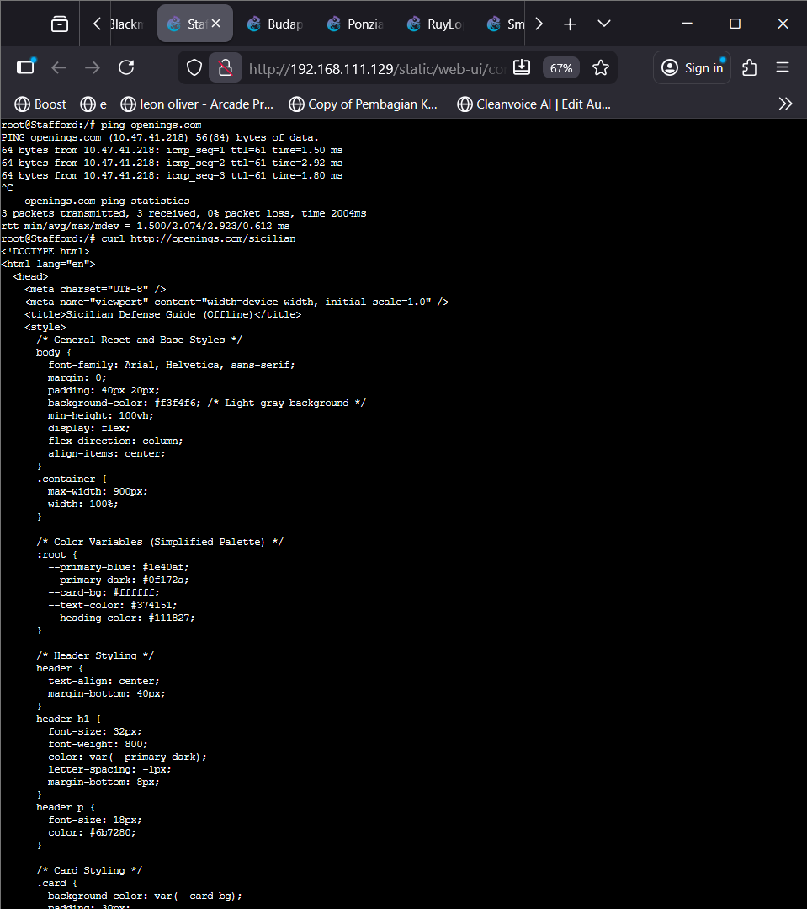
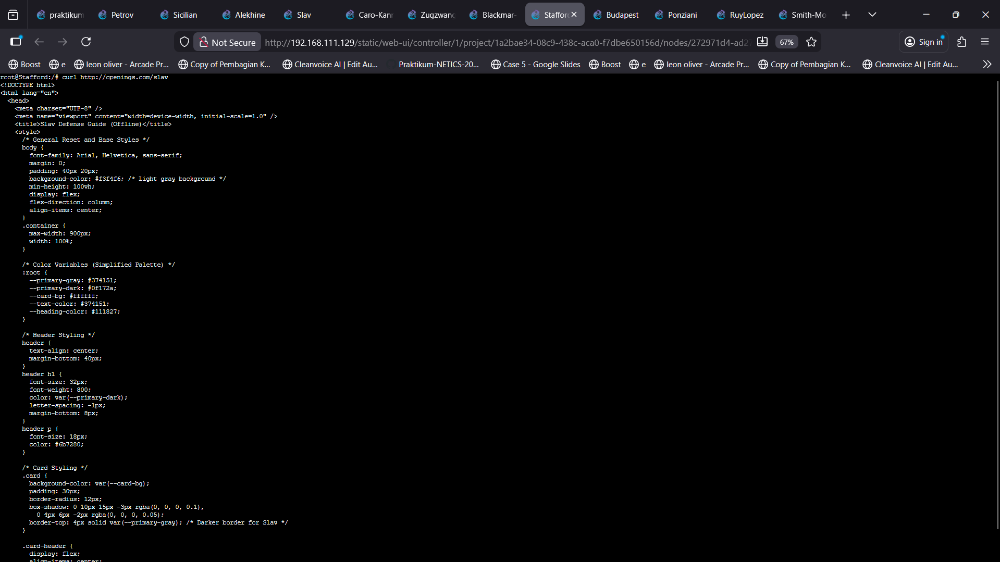
- Explanation

CARO-KAN

```bash
cat >> /etc/bind/named.conf.local << EOF
zone "openings.com" {
    type master;
    file "/etc/bind/db.openings.com";
};
EOF
```
```bash
cat > /etc/bind/db.openings.com << EOF
\$TTL 604800
@ IN SOA caro-kann.burung.terbang. root.openings.com. (
    2025120202
    604800
    86400
    2419200
    604800 )
@     IN  NS  caro-kann.burung.terbang.
@     IN  A   10.47.41.218
www   IN  A   10.47.41.218
EOF
```
```bash
named -g
```
PETROV
```bash
echo "nameserver 8.8.8.8" > /etc/resolv.conf
apt-get update
apt-get install -y nginx
```
```bash
cat > /etc/nginx/sites-available/openings << EOF
server {
    listen 80;
    server_name openings.com www.openings.com;

    location /sicilian {
        proxy_pass http://10.47.41.11/;
    }

    location /slav {
        proxy_pass http://10.47.40.11:8000/;
    }
}
EOF
```


```bash

ln -s /etc/nginx/sites-available/openings /etc/nginx/sites-enabled/
rm /etc/nginx/sites-enabled/default
nginx -t
service nginx restart
```

Petrov dikonfigurasi sebagai Reverse Proxy untuk membelokkan trafik berdasarkan URL. Blok server Nginx dikonfigurasi dengan direktif location /path { ... } yang berisi perintah proxy_pass http://tujuan, berfungsi meneruskan permintaan klien (misalnya /sicilian) ke alamat IP dan port backend server yang spesifik tanpa mengekspos server aslinya secara langsung.

<br>

## Soal 11

> Tambahkan juga konfigurasi agar request untuk “openings.com/**random**” akan mengalihkan request ke webserver **Sicilian** dan **Slav** dengan algoritma _round-robin_.

> _Additionally, configure requests for "openings.com/**random**" to be redirected to the **Sicilian** and **Slav** web servers using a round-robin algorithm._

**Answer:**

- Screenshot

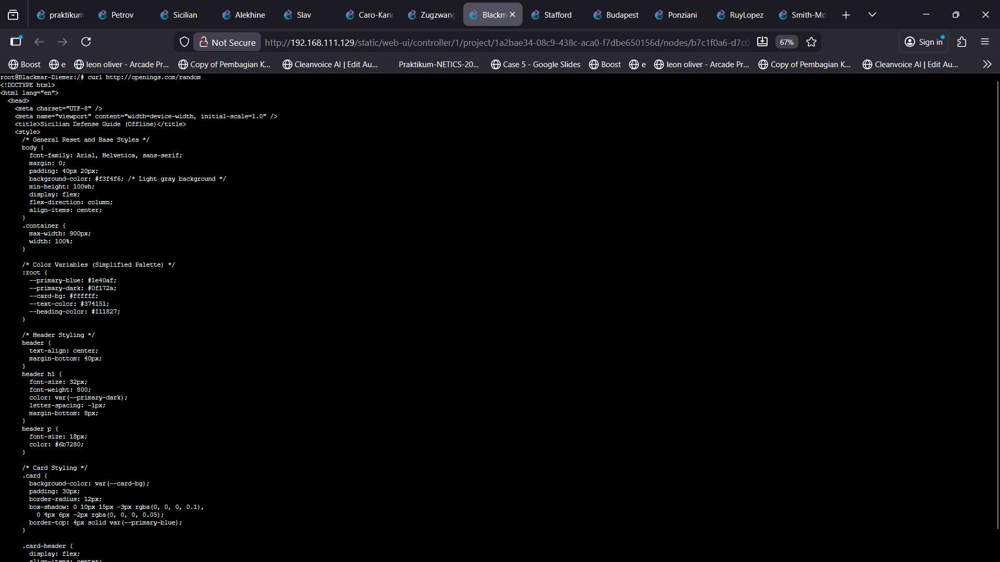

- Explanation

PETROV
```bash
cat > /etc/nginx/sites-available/openings << 'EOF'
upstream backend_servers {
    server 10.47.41.11:80;
    server 10.47.40.11:8000;
}

server {
    listen 80;
    server_name openings.com www.openings.com;

    location /sicilian {
        proxy_pass http://10.47.41.11/;
    }

    location /slav {
        proxy_pass http://10.47.40.11:8000/;
    }

    location /random {
        proxy_pass http://backend_servers/;
    }
}
EOF
```

```bash
ln -s /etc/nginx/sites-available/openings /etc/nginx/sites-enabled/
rm /etc/nginx/sites-enabled/default
service nginx restart
```
Fitur Load Balancing ditambahkan dengan mendefinisikan grup server. Blok upstream backend_servers { ... } dibuat berisi daftar IP dan port semua worker (server IP:Port). Kemudian, pada blok location /random, perintah proxy_pass http://backend_servers digunakan agar Nginx mendistribusikan trafik masuk ke server-server dalam grup tersebut secara bergantian (Round Robin).

<br>

## Soal 12

> Anatoly Parkov berencana untuk melakukan ekspansi secara besar-besaran. Maka dari itu, hapus seluruh konfigurasi Static Routing dan ubah agar seluruh router menggunakan Dynamic Routing. Gunakan protokol RIP!

> _Anatoly Parkov plans to perform a great expansion. Therefore, remove all Static Routing configurations and configure all routers to use Dynamic Routing. Use the RIP protocol!_

**Answer:**

- Screenshot

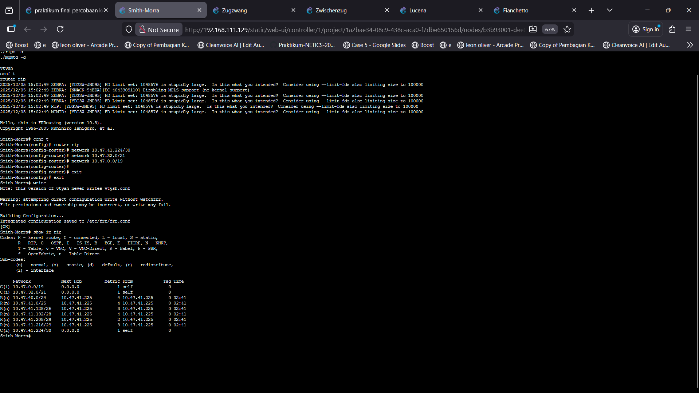
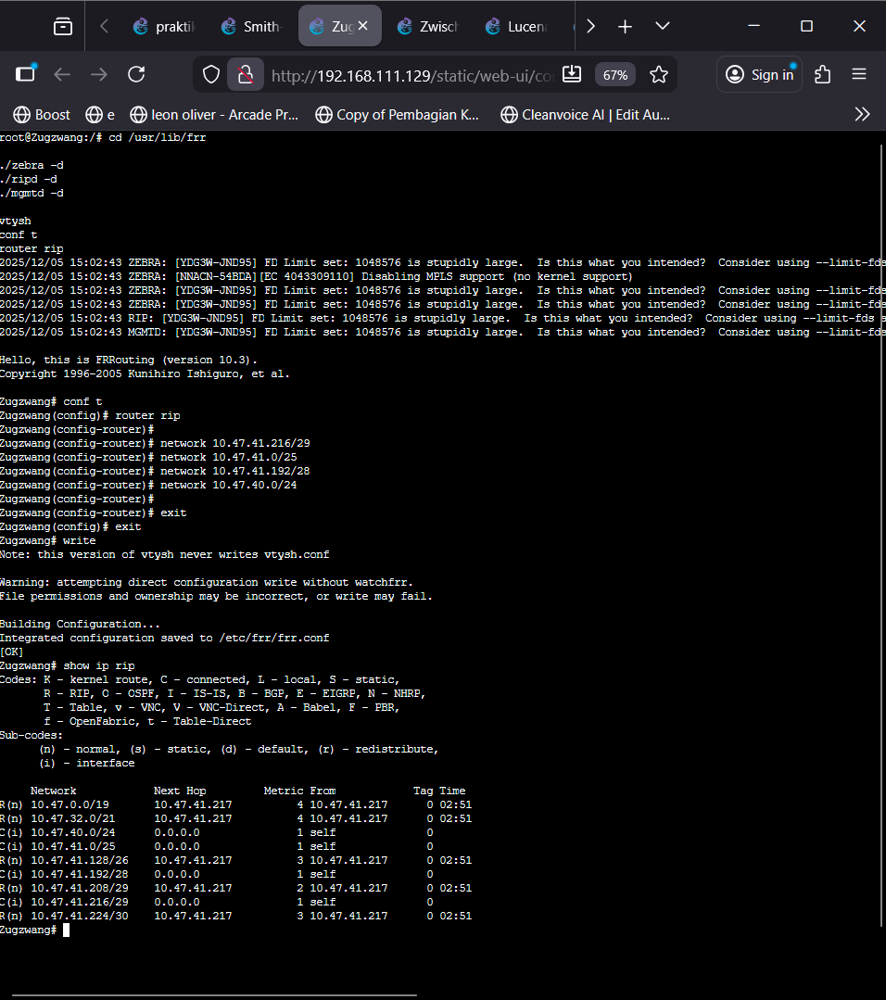
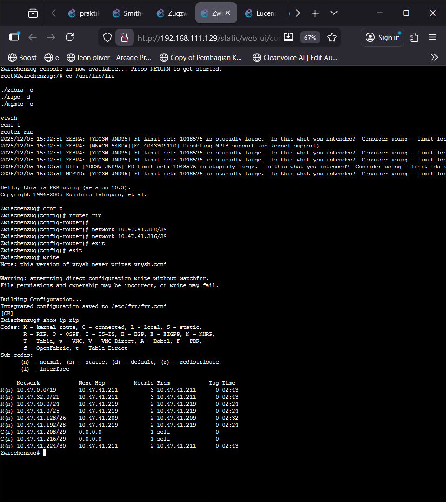
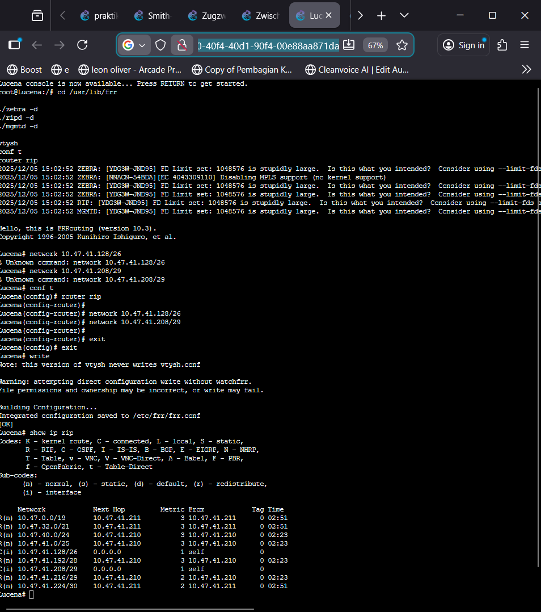
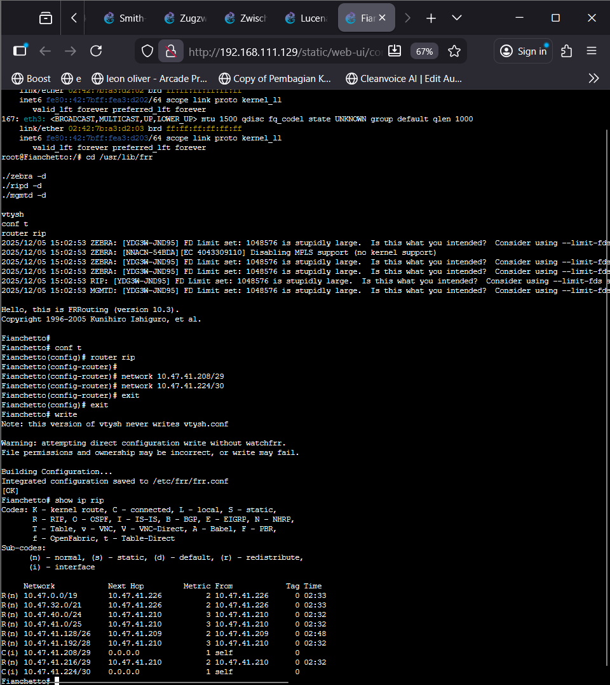
- Explanation


semua router
```bash
cd /usr/lib/frr
```
```bash
./zebra -d
./ripd -d
./mgmtd -d
```
```bash
vtysh
conf t
router rip
```

LUCENA
```bash
network 10.47.41.128/26
network 10.47.41.208/29
```
ZWISCHENZUG
```bash
network 10.47.41.208/29
network 10.47.41.216/29
```
FIANCHETTO
```bash
network 10.47.41.208/29
network 10.47.41.224/30
```
ZUGZWANG
```bash
network 10.47.41.216/29
network 10.47.41.0/25
network 10.47.41.192/28
network 10.47.40.0/24
```
SMITH-MORRA
```bash
network 10.47.41.224/30
network 10.47.32.0/21
network 10.47.0.0/19
```
Routing statis dihapus dan digantikan dengan protokol RIPv2 menggunakan FRR. Perintah sed -i digunakan untuk menghapus konfigurasi rute lama, lalu pada konsol vtysh, perintah router rip dan network [subnet] dijalankan untuk mengumumkan jaringan yang terhubung secara dinamis. Perintah default-information originate pada Smith-Morra digunakan untuk menyebarkan rute default internet ke seluruh router tetangga.
<br>

## Soal 13

> Untuk meningkatkan keamanan, konfigurasikan firewall **Smith-Morra** untuk melakukan pembatasan koneksi SSH ke server DNS. Drop semua packet SSH yang berasal dari seluruh client yang memiliki tujuan ke **Caro-Kann** atau **Alekhine.**

> _To increase security, configure the **Smith-Morra** firewall to restrict SSH connections to the **DNS server.** Drop all SSH packets from all clients destined for **Caro-Kann** or **Alekhine.**_

**Answer:**

- Screenshot

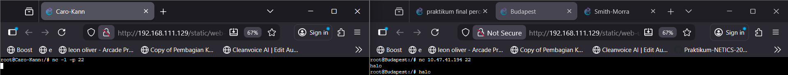
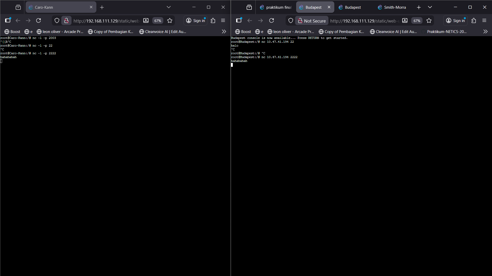
- Explanation
SMITH-MORRA
```bash
iptables -A FORWARD -p tcp --dport 22 -d 10.47.41.194 -j DROP
iptables -A FORWARD -p tcp --dport 22 -d 10.47.41.195 -j DROP
```
Memfilter akses SSH. Menggunakan iptables, aturan dibuat pada rantai FORWARD dengan parameter -p tcp --dport 22 (protokol SSH), -s (sumber subnet klien), dan -d (tujuan subnet server DNS) diakhiri dengan aksi -j DROP, yang membuang paket SSH ilegal yang mencoba melintasi router.
<br>

## Soal 14

> Nampaknya, web server juga manusia sehingga hanya ingin bekerja di hari kerja. Maka dari itu, semua client hanya bisa mengakses **Sicilian** dan **Slav** pada hari Senin-Jumat pada pukul 09:00-17:00.

> _Apparently, web servers are humans too, so they only want to work on weekdays. Therefore, all clients can only access **Sicilian** and **Slav** on Monday through Friday, 9:00 AM to 5:00 PM._

**Answer:**

- Screenshot
gagal karena diluar jam
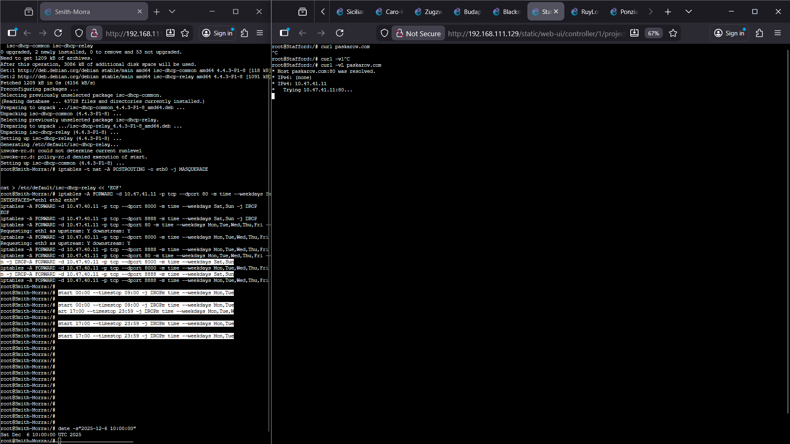
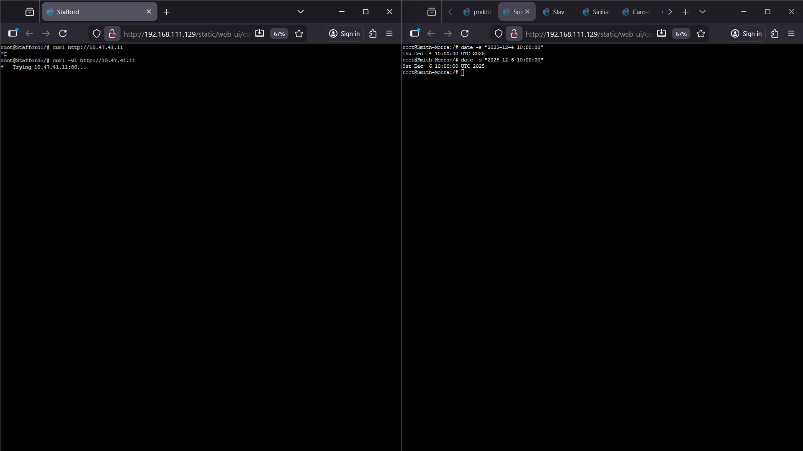

berhasil😛
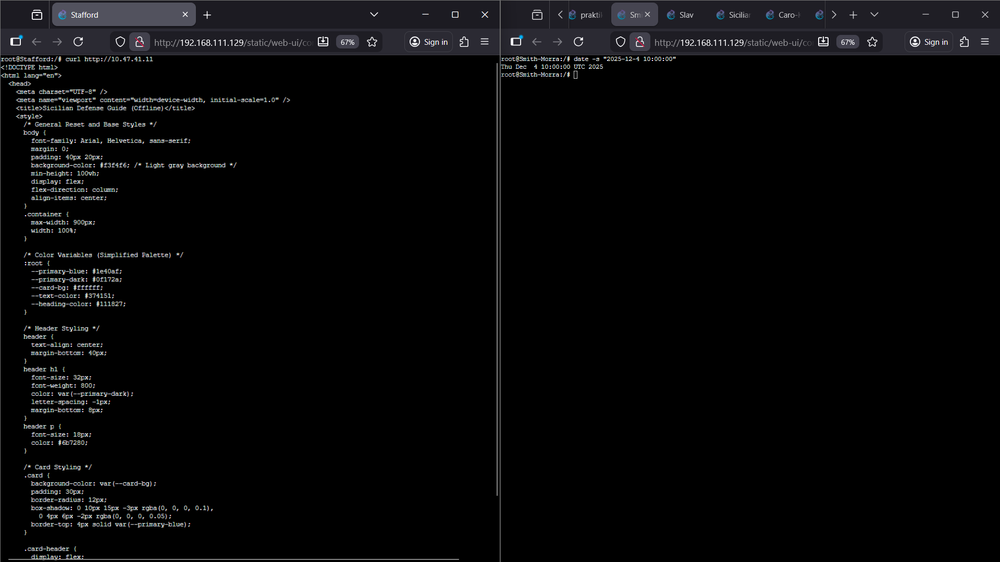

- Explanation
SMITH-MORRA
```bash
iptables -A FORWARD -s 10.47.0.0/19 -d 10.47.41.11 -m time --weekdays Mon,Tue,Wed,Thu,Fri --timestart 09:00 --timestop 17:00 -j ACCEPT
iptables -A FORWARD -s 10.47.0.0/19 -d 10.47.40.11 -m time --weekdays Mon,Tue,Wed,Thu,Fri --timestart 09:00 --timestop 17:00 -j ACCEPT

iptables -A FORWARD -s 10.47.0.0/19 -d 10.47.41.11 -j DROP
iptables -A FORWARD -s 10.47.0.0/19 -d 10.47.40.11 -j DROP

iptables -A FORWARD -s 10.47.32.0/21 -d 10.47.41.11 -m time --weekdays Mon,Tue,Wed,Thu,Fri --timestart 09:00 --timestop 17:00 -j ACCEPT
iptables -A FORWARD -s 10.47.32.0/21 -d 10.47.40.11 -m time --weekdays Mon,Tue,Wed,Thu,Fri --timestart 09:00 --timestop 17:00 -j ACCEPT

iptables -A FORWARD -s 10.47.32.0/21 -d 10.47.41.11 -j DROP
iptables -A FORWARD -s 10.47.32.0/21 -d 10.47.40.11 -j DROP
```
Akses web dibatasi berdasarkan waktu menggunakan modul ekstensi IPTables. Aturan ditambahkan dengan parameter -m time --weekdays Mon,Tue... --timestart 09:00 --timestop 17:00 -j ACCEPT untuk mengizinkan trafik pada jam kerja. Aturan DROP umum ditempatkan di baris berikutnya untuk memblokir semua trafik yang tidak memenuhi kriteria waktu tersebut.
<br>

## Soal 15

> Terakhir, Gerry Paskarov berpesan untuk selalu melakukan logging, sehingga konfigurasikan fitur logging untuk melakukan log terhadap seluruh paket yang di-DROP pada firewall **Smith-Morra.**
> _Finally, Gerry Paskarov advises to always perform logging, so configure a logging feature to log all packets dropped on the **Smith-Morra** firewall._

**Answer:**

- Screenshot

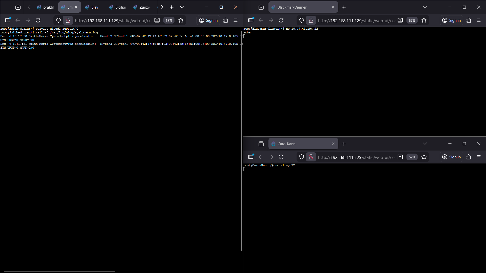

- Explanation

SMITH-MORRA

```bash
apt-get update
apt-get install ulogd2 -y
```
```bash

iptables -F
```
```bash

iptables -N LOGGING
iptables -A LOGGING -m limit --limit 2/min -j NFLOG --nflog-group 0 --nflog-prefix "Cyrtodactylus pecelmadiun: "
iptables -A LOGGING -j DROP

iptables -A FORWARD -p tcp --dport 22 -d 10.47.41.194 -j LOGGING
iptables -A FORWARD -p tcp --dport 22 -d 10.47.41.195 -j LOGGING

iptables -A FORWARD -s 10.47.0.0/19 -d 10.47.41.11 -m time --weekdays Mon,Tue,Wed,Thu,Fri --timestart 09:00 --timestop 17:00 -j ACCEPT
iptables -A FORWARD -s 10.47.0.0/19 -d 10.47.40.11 -m time --weekdays Mon,Tue,Wed,Thu,Fri --timestart 09:00 --timestop 17:00 -j ACCEPT

iptables -A FORWARD -s 10.47.0.0/19 -d 10.47.41.11 -j LOGGING
iptables -A FORWARD -s 10.47.0.0/19 -d 10.47.40.11 -j LOGGING

iptables -A FORWARD -s 10.47.32.0/21 -d 10.47.41.11 -m time --weekdays Mon,Tue,Wed,Thu,Fri --timestart 09:00 --timestop 17:00 -j ACCEPT
iptables -A FORWARD -s 10.47.32.0/21 -d 10.47.40.11 -m time --weekdays Mon,Tue,Wed,Thu,Fri --timestart 09:00 --timestop 17:00 -j ACCEPT

iptables -A FORWARD -s 10.47.32.0/21 -d 10.47.41.11 -j LOGGING
iptables -A FORWARD -s 10.47.32.0/21 -d 10.47.40.11 -j LOGGING
```


```bash
service ulogd2 restart
```

Mekanisme audit diterapkan dengan mencatat paket yang dibuang. Sebuah chain baru dibuat di mana aturan iptables ... -j NFLOG --nflog-prefix "Pesan..." digunakan untuk mengirim metadata paket ke sistem logging pengguna (ulogd2) sebelum paket tersebut dieksekusi dengan -j DROP.
<br>
  
## Problems

## Revisions (if any)
